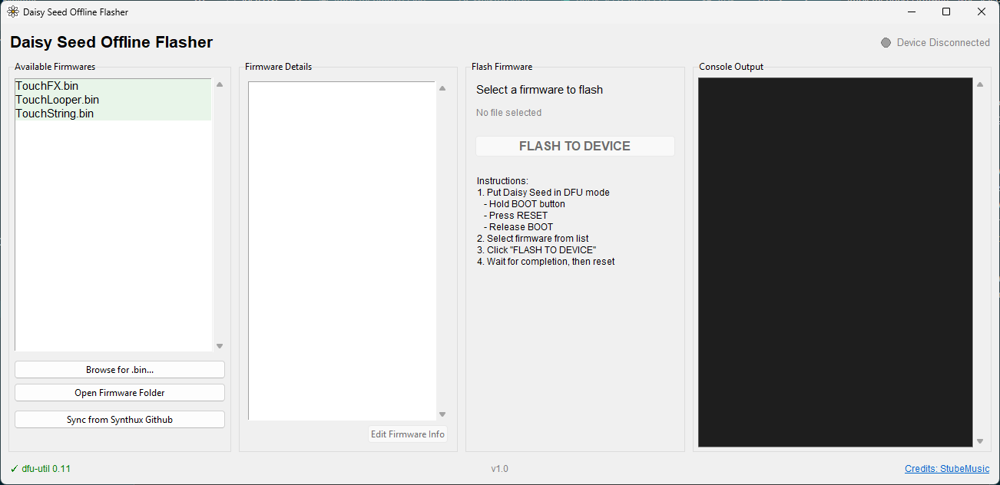

# Daisy Seed Offline Flasher



A cross-platform GUI for managing and flashing firmware to any Daisy Seed device — no terminal required.

---

## Features

- **Firmware Library** — Organize all your `.bin` files in one place. View embedded Markdown documentation for each firmware directly inside the app.
- **Firmware Sync** *(under development)* — The "Sync from Synthux Github" button currently ships with a curated set of Synthux Touch 2 firmwares hardcoded in `firmwares_manifest.json`. A future update will replace this with a live manifest hosted on the official Synthux Academy GitHub, so new official firmwares appear automatically without any app update.
- **Auto-Install dfu-util** — The app downloads and configures the correct `dfu-util` binary for your operating system automatically.
- **Windows USB Driver (Zadig)** — On Windows, a dedicated "Install USB Driver (Zadig)" button downloads and launches Zadig so you can install the required WinUSB driver for the Daisy Seed bootloader in a few clicks.
- **One-Click Flash** — Flash firmware without touching the terminal.
- **Smart Device Detection** — Automatically polls for Daisy Seeds in DFU mode. Handles multiple connected devices with a selection prompt.

---

## Quick Start

### Option A — Standalone executable (no Python required)

Pre-built executables are available on the [Releases page](https://github.com/ymillion/daisy-seed-local-offline-flasher/releases). The binaries are compiled automatically by GitHub Actions directly from the source code. Download the file for your platform and run it directly — no installation needed.

- **Windows:** [DaisySeedLocalOfflineFlasher-Windows.exe](https://github.com/ymillion/daisy-seed-local-offline-flasher/releases/download/v1.0/DaisySeedLocalOfflineFlasher-Windows.exe)
- **macOS:** [DaisySeedLocalOfflineFlasher-macOS](https://github.com/ymillion/daisy-seed-local-offline-flasher/releases/download/v1.0/DaisySeedLocalOfflineFlasher-macOS)
- **Linux:** [DaisySeedLocalOfflineFlasher-Linux](https://github.com/ymillion/daisy-seed-local-offline-flasher/releases/download/v1.0/DaisySeedLocalOfflineFlasher-Linux)

### Option B — Run from source (requires Python)

Ensure you have **Python 3.7 or later** installed. No additional Python packages are required.

Download or clone this repository, then launch the app using the script for your operating system:

- **Windows:** Double-click `launch.bat`
- **macOS:** Double-click `launch.command`
- **Linux:** Run `./launch.sh` in your terminal

If the app shows that `dfu-util` is not found, click the **"Auto-Install dfu-util"** button to let the app set it up automatically.

---

## Windows USB Driver Setup

On Windows, `dfu-util` requires the WinUSB driver to be installed for the Daisy Seed bootloader (`STM32 BOOTLOADER`, VID/PID `0483:df11`).

1. Put the Daisy Seed into DFU mode (see below).
2. Click the **"Install USB Driver (Zadig)"** button in the app. Zadig will download automatically and launch.
3. In Zadig, select **STM32 BOOTLOADER** from the dropdown and click **Install Driver**.

This only needs to be done once per machine.

---

## Usage Guide

1. **Enter DFU Mode** on your Daisy Seed:
   - Connect the Seed to your computer with a USB cable
   - Press and hold the **BOOT** button
   - Press and hold the **RESET** button
   - Release the **RESET** button
   - Release the **BOOT** button
   - The indicator at the top-right of the app will turn green when the device is detected

2. **Select Firmware** from the left panel, or click **"Browse for .bin..."** to load a custom file.

3. Click **"FLASH TO DEVICE"** and wait for the success message.

4. Press the **RESET** button on the Daisy Seed to boot into the new firmware.

---

## Manual dfu-util Setup (Optional)

If you prefer to install `dfu-util` yourself instead of using the in-app installer:

**macOS:**
```bash
brew install dfu-util
```

**Linux (Debian/Ubuntu):**
```bash
sudo apt install dfu-util
```

**Windows:**

Use the **"Auto-Install dfu-util"** button in the app, or download `dfu-util-0.11-binaries.tar.xz` from the [official release page](https://dfu-util.sourceforge.net/releases/), extract it, and place the `win64` folder contents in `bin/dfu-util/dfu-util-0.11-binaries/win64/` inside the app directory.

---

## Folder Structure

```text
Daisy_Seed_Flasher/
├── daisy_seed_flasher.py
├── launch.bat                  # Windows launcher
├── launch.command              # macOS launcher
├── launch.sh                   # Linux launcher
├── firmwares_manifest.json     # Firmware registry for cloud sync
├── firmwares/                  # Place .bin and .md files here
├── bin/                        # Auto-populated: dfu-util and Zadig (not in repo)
├── img/
│   └── daisy_seed_flasher.png
└── README.md
```

---

## Troubleshooting

**"No DFU capable USB device available"**
The device is not in DFU mode. Follow the DFU mode steps above.

**"Multiple DFU-capable USB devices found"**
More than one device is in DFU mode. A device picker will appear — select the correct serial number, or disconnect all but the target device and retry.

**"dfu-util not found"**
Click the **"Auto-Install dfu-util"** button in the app, or follow the manual setup steps above.

**On Windows, dfu-util says "Cannot open DFU device" or similar**
The WinUSB driver is not installed. Click **"Install USB Driver (Zadig)"** and follow the Zadig steps above.

---

## License & Credits

Licensed under the [MIT License](LICENSE).

- Built alongside the **Synthux Academy** community.
- Original idea and implementation by **StubeMusic** — [StubeMusicMedia on YouTube](https://www.youtube.com/@StubeMusicMedia)
